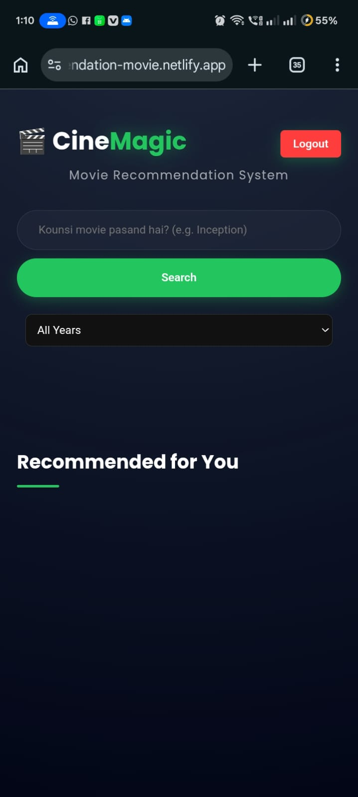
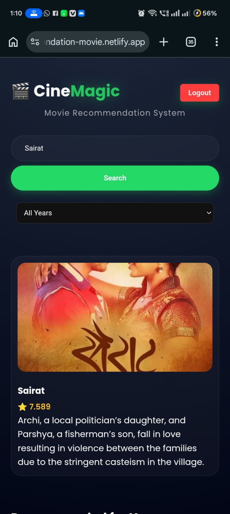
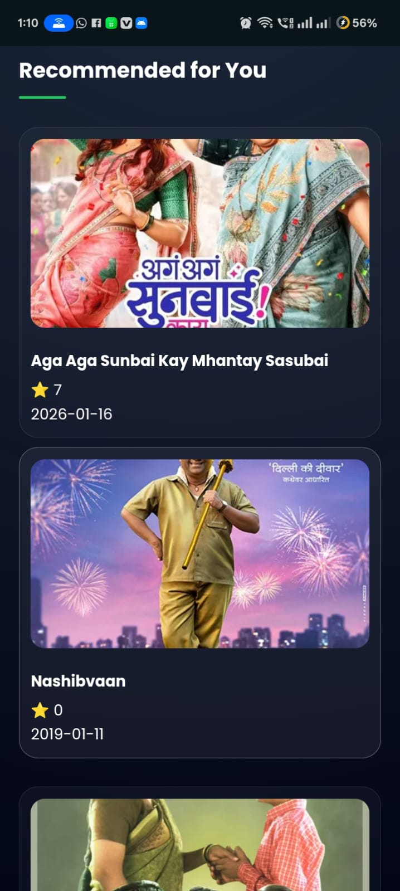

# 🎬 CineMagic — Smart Movie Recommendation & Streaming Web App

**CineMagic** is a modern **Movie Recommendation & Streaming Web Application** built using **HTML, CSS, JavaScript, Firebase Authentication, and TMDB API**.

CineMagic allows users to **login securely, search movies, get smart recommendations, and watch movies using multiple streaming sources with an auto-fallback system**.

---

# 🚀 Live Demo

🔗 https://recommendation-movie.netlify.app/

---

# 📂 GitHub Repository

🔗 https://github.com/rushi076/movie-recommendation-system

---

# ✨ Features

🔐 Firebase Authentication (Login / Signup)
🎬 Smart Movie Recommendation
🔍 Search Movies Functionality
🌐 TMDB API Integration
🎥 Movie Streaming Player
🔄 Auto Fallback Streaming System
🎯 Genre Based Filtering
🌎 Language Based Filtering
📅 Year Based Filtering
📱 Fully Responsive Design
⚡ Fast and Lightweight UI

---

# 🛠️ Tech Stack

Frontend

* HTML
* CSS
* JavaScript

Backend / Services

* Firebase Authentication
* TMDB API

Streaming Sources

* VidSrc
* AutoEmbed
* MultiEmbed
* Backup Sources

---

# 🔗 API Used

## TMDB (The Movie Database) API

Used for:

* Movie Titles
* Movie Posters
* Movie Ratings
* Movie Details
* Genre Information

---

# 🔐 Authentication

CineMagic uses **Firebase Authentication** for:

* User Signup
* User Login
* Secure Access

---

# 🧠 CineMagic Architecture

User Search → Frontend → TMDB API → Movie Data → Recommendation Engine → UI → Movie Player → Streaming Sources → Auto Fallback → Google Search

---

# ⚙️ Architecture Flow

### 1. User Search

User searches movie using search bar

↓

### 2. Frontend

Frontend built with HTML, CSS, JavaScript

↓

### 3. TMDB API Request

Fetch movie data dynamically

↓

### 4. Movie Data

* Movie Details
* Posters
* Ratings
* Genre

↓

### 5. Recommendation Engine

Custom JavaScript Logic:

* Genre Filter
* Language Filter
* Year Filter

↓

### 6. Recommended Movies UI

Movies displayed dynamically

↓

### 7. Movie Player System

User clicks movie to play

↓

### 8. Streaming Sources

Multiple sources available:

* VidSrc
* AutoEmbed
* MultiEmbed
* Backup Sources

↓

### 9. Auto Fallback System

If Source 1 fails:

* Try Source 2
* Try Source 3
* Try Backup Sources

↓

### 10. Final Fallback

If all sources fail:

→ Redirect to Google Search

---

# 🎥 Movie Player System

CineMagic includes:

* Multiple Streaming Sources
* Auto Fallback
* Smooth Movie Loading
* Better User Experience

---

# ⚙️ How to Run Locally

### 1. Clone Repository

git clone https://github.com/rushi076/movie-recommendation-system.git

---

### 2. Navigate to Project

cd movie-recommendation-system

---

### 3. Add Firebase Configuration

Add your Firebase config in JS file

---

### 4. Run Project

Open index.html in browser

---

## 📸 Screenshots

### Home Screen

### Search Result

### Recommended Movies

---

# 📈 Future Improvements

* Watchlist Feature
* User Preferences
* Movie History
* Better Recommendation Engine
* UI Animations
* Dark Mode Enhancement

---

# 🎯 Project Purpose

This project demonstrates:

* API Integration
* Firebase Authentication
* Recommendation Logic
* Streaming Fallback System
* Frontend Development
* Real-world Web Application

---

# 👨‍💻 Author

**Rushikesh Bhojane**
BCS Student | Web Developer

GitHub: https://github.com/rushi076
Live Project: https://recommendation-movie.netlify.app/

---

# ⭐ Support

If you like this project:

⭐ Give it a Star on GitHub
🚀 Share with Others
💡 Suggest Improvements

---

# 🎬 CineMagic

Smart Movie Recommendation
Better Streaming
Smooth Experience

Made with ❤️ by Rushikesh Bhojane
